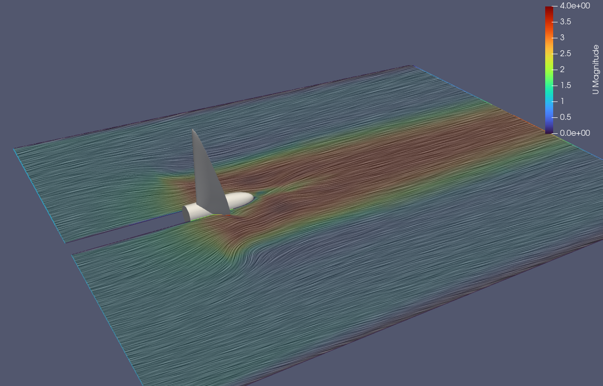
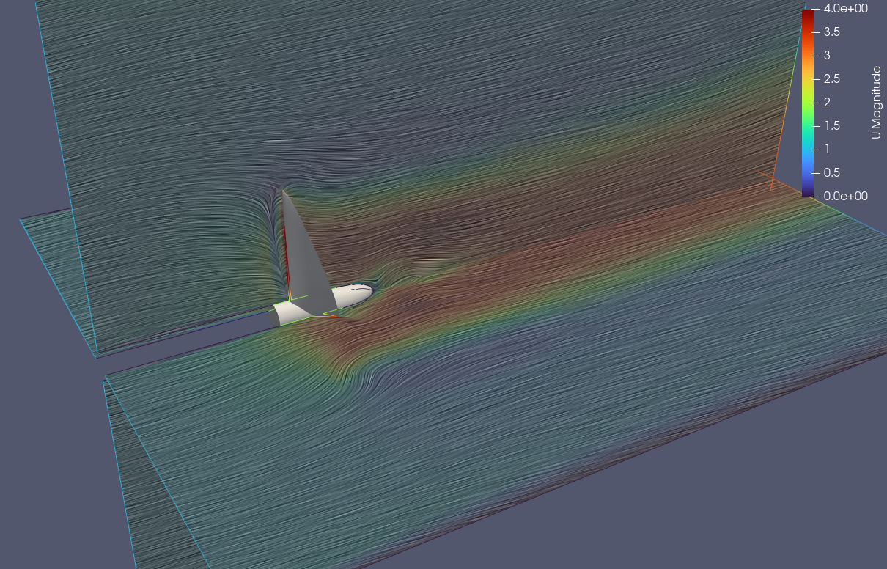
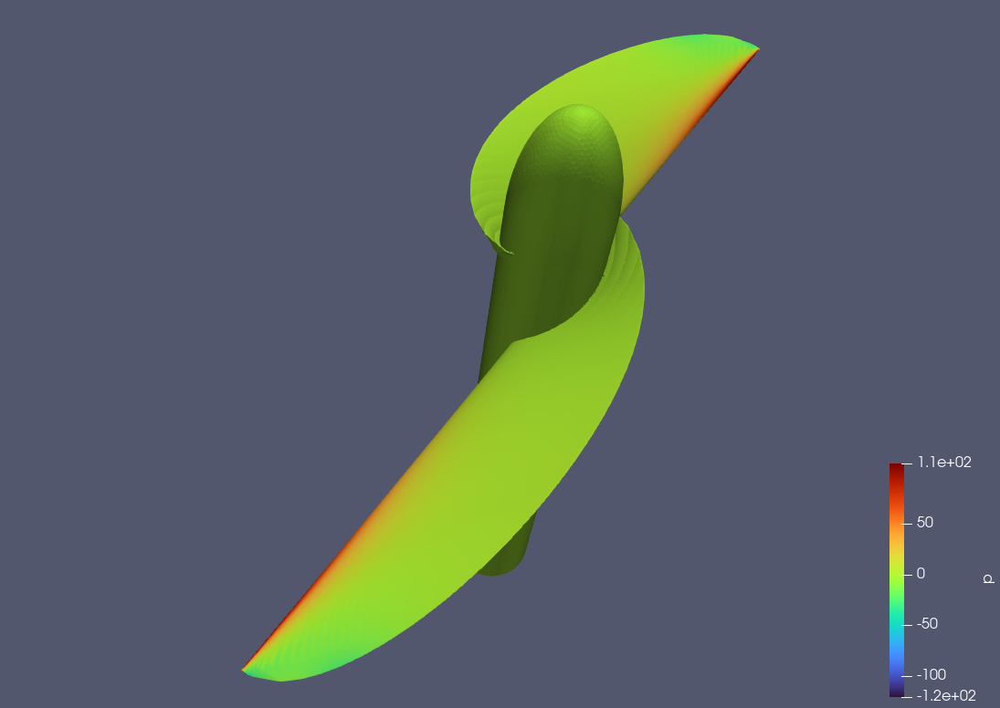
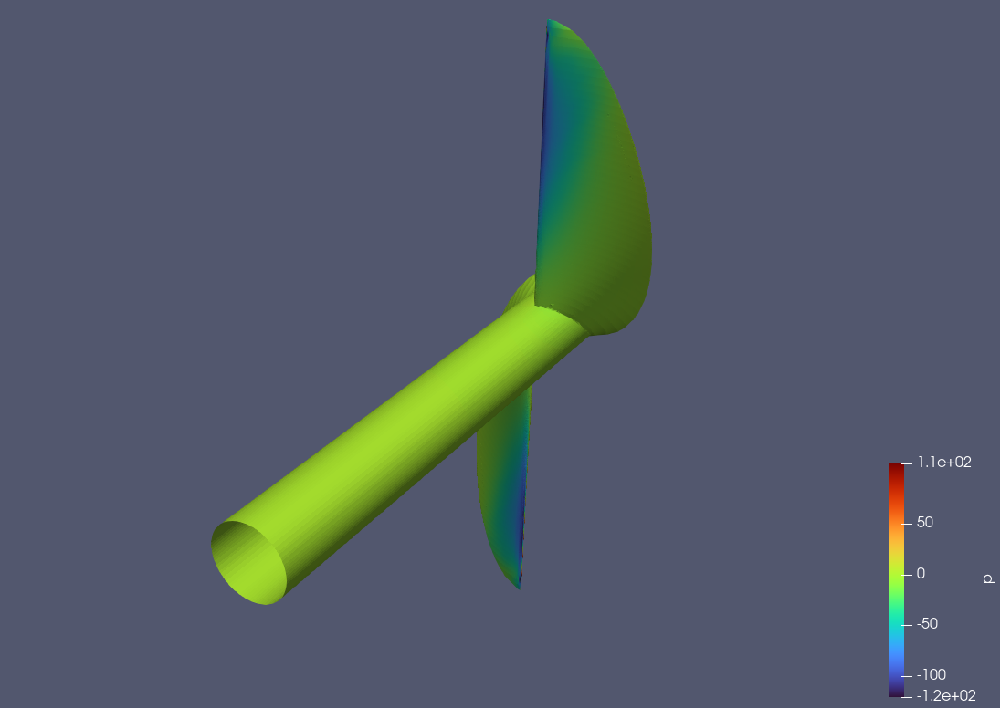
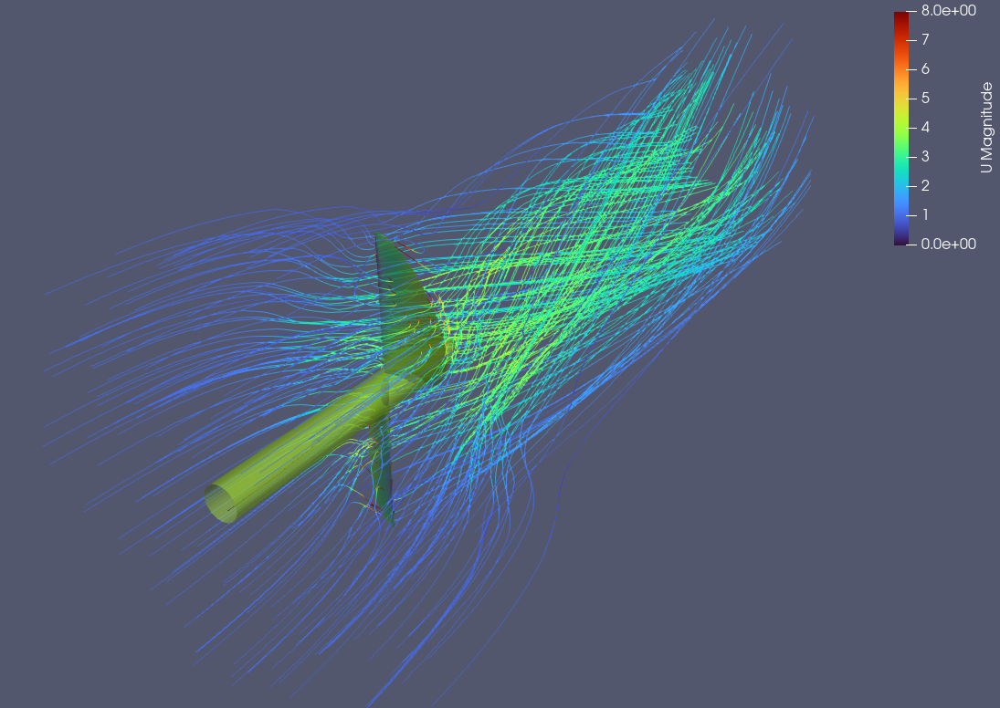

# README - hydro_prop

This repo is an example for CFD and FEM analysis of a hydro propeller for ships. At the Moment only
MRF-Openfoam cases for incompressible fluid is working

In the next pictures you can see the results of the study_example_1. The geometry of the propeller and the mesh
of the propeller itself is generated by Salome. The definition you can find in the config.json in the study directory.









The code is the documentation 😉


## Requirements

You need a environment to call ccx and also salome 9.15.0 to execute calculation, and you need a OpenFOAM-Installation (tested with OpenFOAM-14).
For other OpenFOAM-Versions you have to adapt the templates.
In your virtual python environment you have to install following packages

```shell
pip install numpy deepmerge pyFoam
```

After loading the venv you have to load salome python environment with
```shell
. path_to_salome/SALOME-9.15.0-native-UB24.04-SRC/env_launch.sh
```
adapt path to the salome script. And for running OpenFOAM
```shell
. /opt/OpenFOAM/OpenFOAM-dev/etc/bashrc
```

In root diretory you can run now

```shell
pip install -e .
```

Then you can run studies with these 3 commands for meshing witch salome and running OpenFOAM
for fluid mesh and calculation:

```shell
python3 -m  hydro_prop.run_meshing --study run/study_example_1/
python3 -m  hydro_prop.run_openfoam --study run/study_example_1/ --type meshes
python3 -m  hydro_prop.run_openfoam --study run/study_example_1/ --type cases
```

## Development

I will extend the possibilities in future, but depends on free time.

Next topics are:

- to get a calculix case running
- transient OpenFOAM cases
- coupling OpenFOAM and calculix with preCICE

If you understand the code, you can easily extend your own modules and templates
